# 👋 Hola, soy Alvaro Vicente  

🎓 Estudiante de Ingeniería en Sistemas  
💻 Desarrollador Full Stack Junior  
🚀 Apasionado por la tecnología, el aprendizaje continuo y la creación de soluciones prácticas y funcionales.  

---

## 👨‍💻 Sobre mí  
- 🔭 Actualmente trabajando en proyectos académicos y personales  
- 🌱 Aprendiendo más sobre **.NET, C#, SQL Server, PostgreSQL, Supabase, Laravel y React**  
- ⚡ Me interesa el desarrollo **Full Stack**, la gestión de bases de datos y las metodologías ágiles  
- 🤝 Participación en hackathons y proyectos colaborativos  

---

## 🛠️ Tecnologías y Herramientas  

### Lenguajes  
 
 
 
 
  

### Frameworks y Librerías  
 

### Bases de Datos  
 
  
  

### Control de versiones  
 
  

---

## 📌 Proyectos Destacados  

### 🏨 Hotel Madero – Sistema de gestión hotelera  
Proyecto académico desarrollado en **C# y SQL Server**.  
🔹 Funcionalidades: reservas, check-in/check-out, gestión de habitaciones y ventas.  
🔹 Arquitectura por capas (Presentación, Negocio, Datos)  
📷 Capturas:  
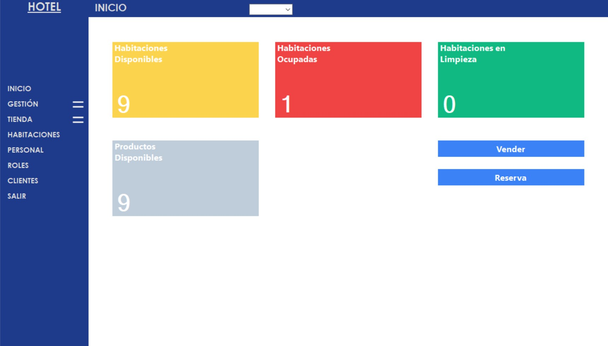  
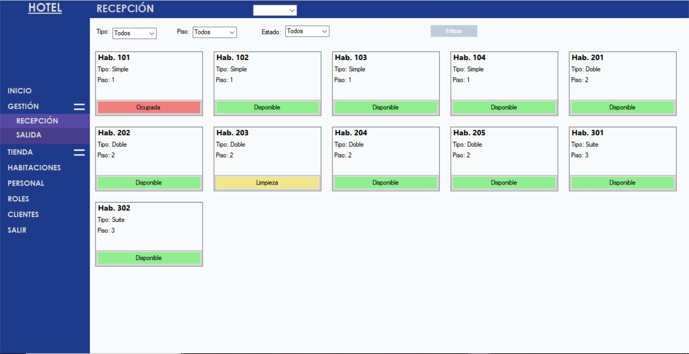
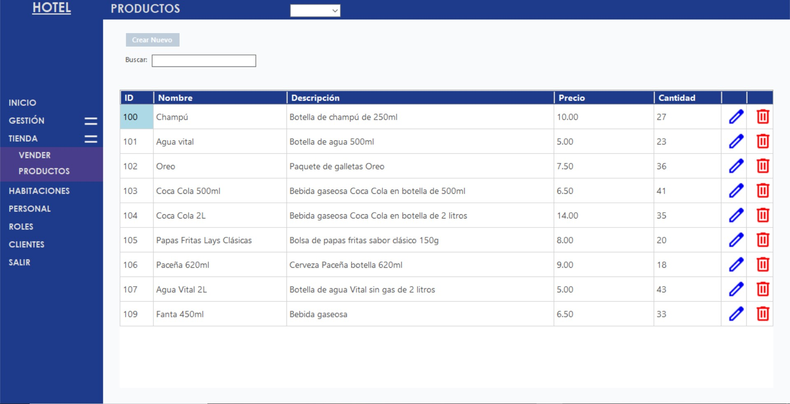
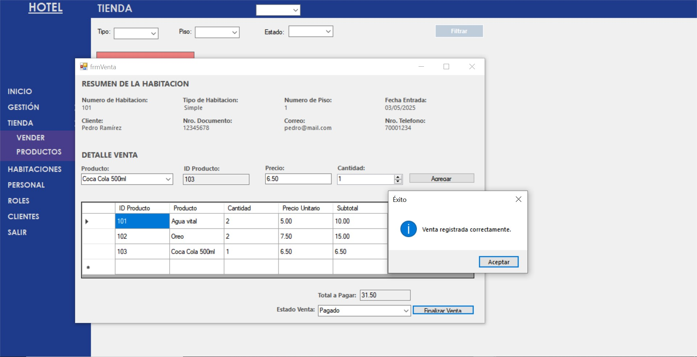

---

### 📊 ContaBol – Sistema contable académico  
Desarrollado en **C# y SQL Server**.  
🔹 Funcionalidades: registro de cuentas, reportes contables, generación automática de Libro Diario.  
📷 Capturas:  
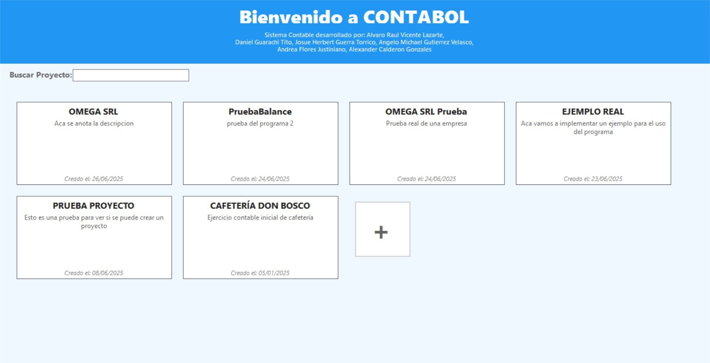  
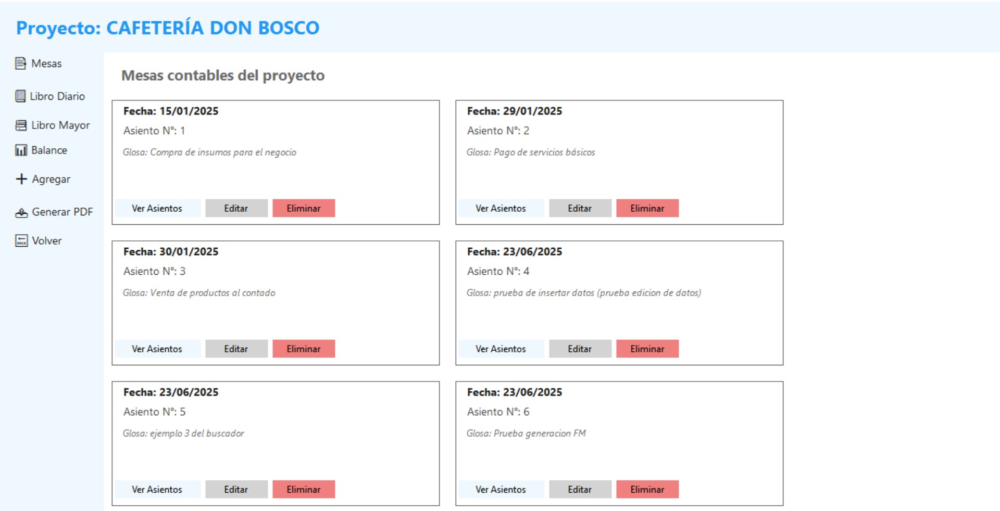
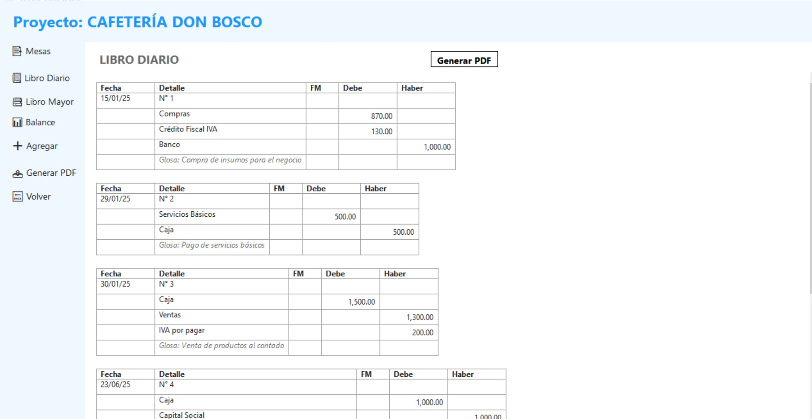  

---

### 🛒 Tienda Licorería CasaDaza – Sistema de ventas  
Frontend hecho con **HTML, CSS y JavaScript**. Backend y base de datos en **Supabase**.  
🔹 Gestión de productos, banners y ventas desde un panel administrativo.  
🔹 Interfaz responsiva y funcional.  
📷 Capturas:  
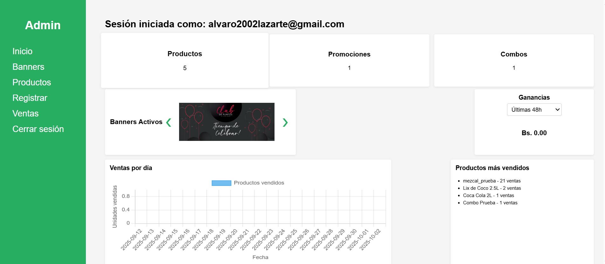  
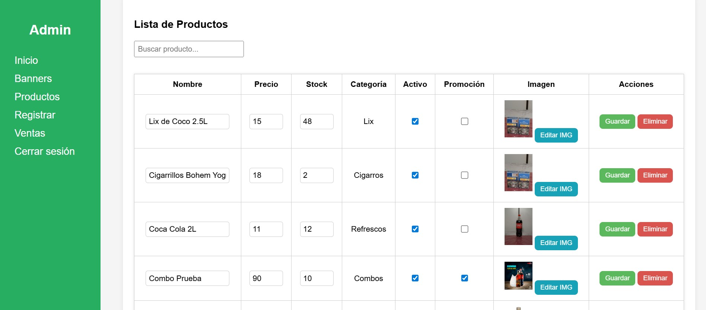
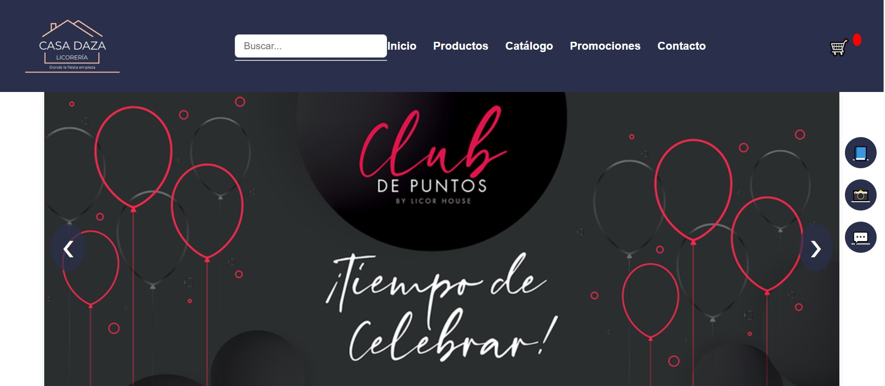  
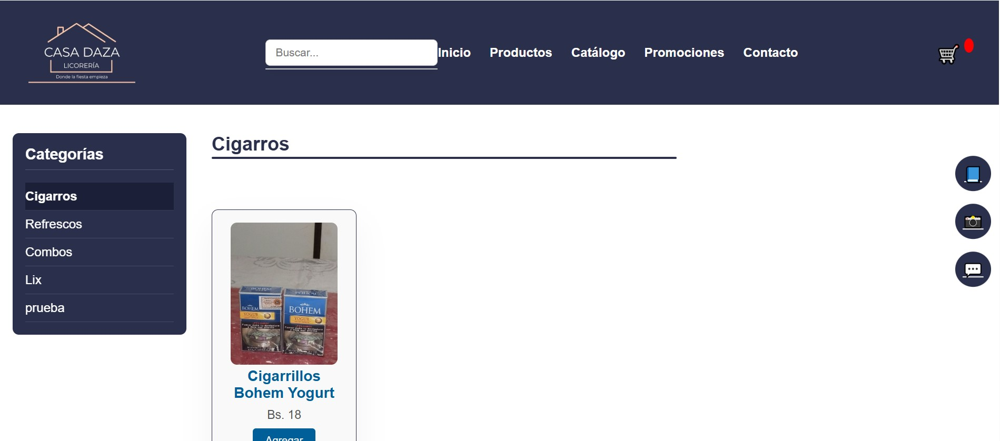  
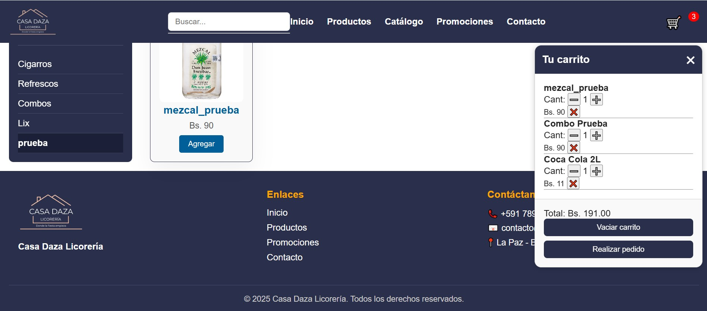  

---

## 🎖️ Certificados y Logros  

- ✅ **Programación Orientada a Objetos en Python** – Fundación DISKTOPIA & UMSA (2022)  
- ✅ **Fundamentos de C#** – FreeCodeCamp / Microsoft (2025)  
- 🏆 **Participación en Hackathon Camballey 2025** – Dirección de Juventud  

---

📫 **Correo:** alvaro2002lazarte@gmail.com  
📱 **Teléfono:** 72553154  

---
